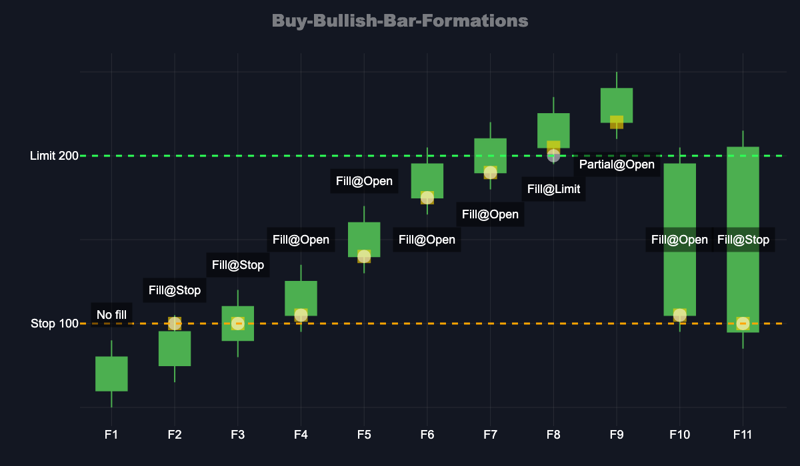
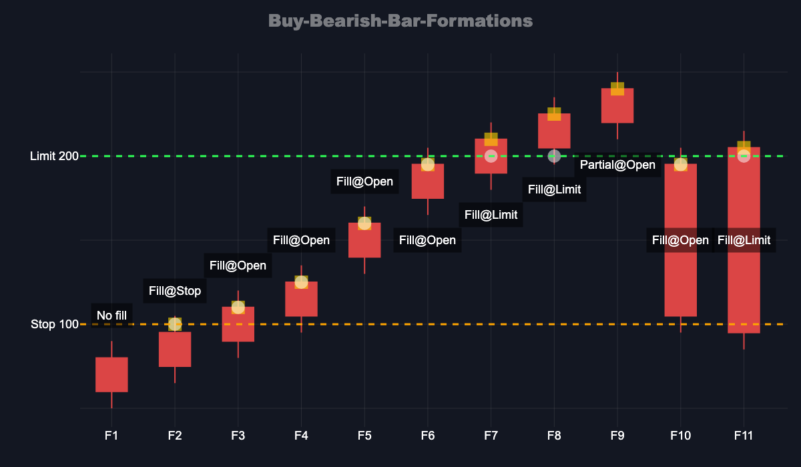
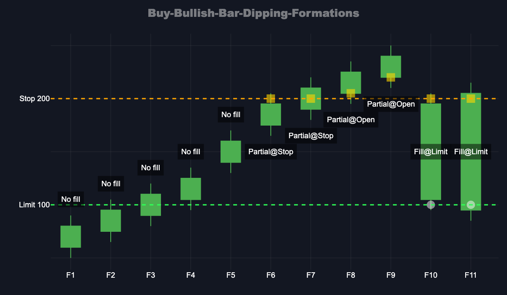
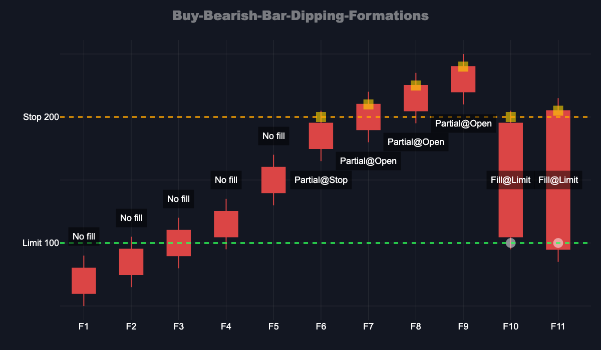
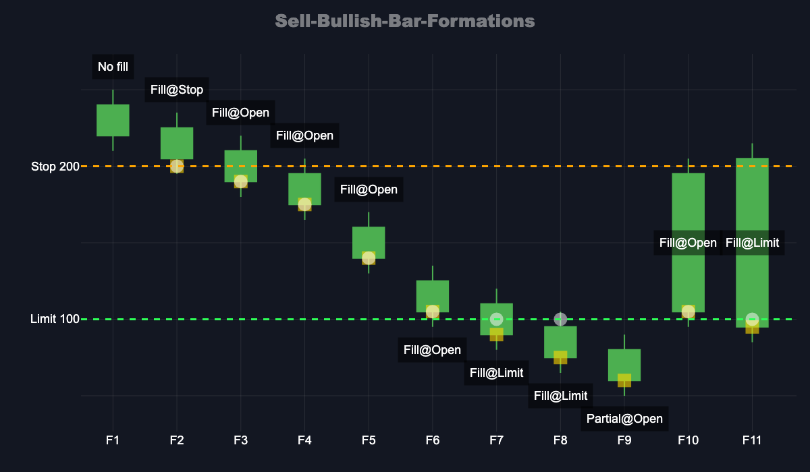
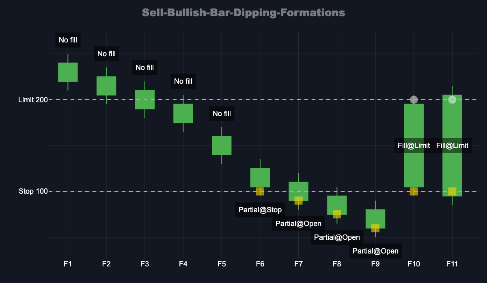
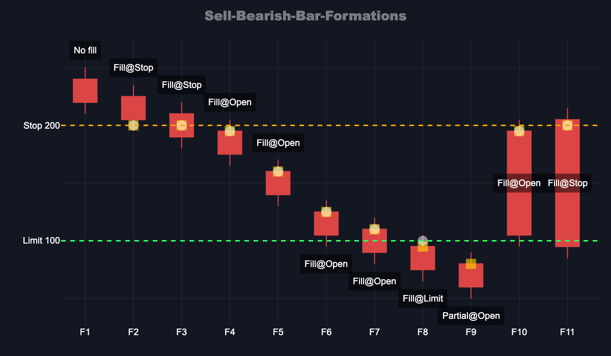
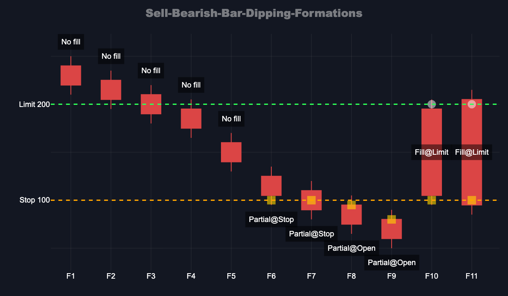

# Stop-Limit Order Formations

## Introduction

This document catalogs all possible price formations for stop-limit order execution in OHLCV-based simulation. Its primary purpose is to serve as a **systematic test specification** - each formation represents a distinct geometric relationship between bar prices (Open, High, Low, Close) and order parameters (Stop, Limit), ensuring comprehensive test coverage of the execution engine.

**Why This Matters:**
- **Exhaustive Coverage**: By enumerating all possible price level orderings (11 formations per scenario), we ensure no edge case is missed in testing
- **Deterministic Behavior**: Each formation documents the expected fill outcome (price and trigger point), establishing the correct execution logic
- **Regression Prevention**: Tests built from these formations validate that execution engine changes don't break existing behavior

**Document Structure:**
Each section covers a specific scenario (action type × bar direction × order configuration), with 11 formations (F1-F11) representing all possible spatial arrangements of prices and order parameters. The formations progress from "stop/limit far from bar" to "stop/limit within bar range" to "bar fully beyond stop/limit zone".

## Table of Contents

1. [BUY Orders - Bullish Bar (Limit > Stop)](#1-buy-orders---bullish-bar-limit--stop)
2. [BUY Orders - Bearish Bar (Limit > Stop)](#2-buy-orders---bearish-bar-limit--stop)
3. [BUY Orders - Bullish Bar (Stop > Limit - Dipping/Pullback Scenarios)](#3-buy-orders---bullish-bar-stop--limit---dippingpullback-scenarios)
4. [BUY Orders - Bearish Bar (Stop > Limit - Dipping/Pullback Scenarios)](#4-buy-orders---bearish-bar-stop--limit---dippingpullback-scenarios)
5. [SELL Orders - Bullish Bar (Stop > Limit)](#5-sell-orders---bullish-bar-stop--limit)
6. [SELL Orders - Bullish Bar (Limit > Stop - Dipping/Pullback Scenarios)](#6-sell-orders---bullish-bar-limit--stop---dippingpullback-scenarios)
7. [SELL Orders - Bearish Bar (Stop > Limit)](#7-sell-orders---bearish-bar-stop--limit)
8. [SELL Orders - Bearish Bar (Limit > Stop - Dipping/Pullback Scenarios)](#8-sell-orders---bearish-bar-limit--stop---dippingpullback-scenarios)

---

## 1. BUY Orders - Bullish Bar (Limit > Stop)

### Formations and Data

| Formation |Highest point  |      (>)     |      (>)     |      (>)      |      (>)     |Lowest point| Stop Fill    | Limit Fill   |
|-----------|---------------|--------------|--------------|---------------|--------------|------------|--------------|--------------|
| F1        | Limit (@200)  | Stop (@100)  | High (@90)   | Close (@80)   | Open (@60)   | Low (@50)  | No fill      | No fill      |
| F2        | Limit (@200)  | High (@105)  | Stop (@100)  | Close (@95)   | Open (@75)   | Low (@65)  | Stop (100)   | Stop (100)   |
| F3        | Limit (@200)  | High (@120)  | Close (@110) | Stop (@100)   | Open (@90)   | Low (@80)  | Stop (100)   | Stop (100)   |
| F4        | Limit (@200)  | High (@135)  | Close (@125) | Open (@105)   | Stop (@100)  | Low (@95)  | Open (105)   | Open (105)   |
| F5        | Limit (@200)  | High (@170)  | Close (@160) | Open (@140)   | Low (@130)   | Stop (@100)| Open (140)   | Open (140)   |
| F6        | High (@205)   | Limit (@200) | Close (@195) | Open (@175)   | Low (@165)   | Stop (@100)| Open (175)   | Open (175)   |
| F7        | High (@220)   | Close (@210) | Limit (@200) | Open (@190)   | Low (@180)   | Stop (@100)| Open (190)   | Open (190)   |
| F8        | High (@235)   | Close (@225) | Open (@205)  | Limit (@200)  | Low (@195)   | Stop (@100)| Open (205)   | Limit (200)  |
| F9        | High (@250)   | Close (@240) | Open (@220)  | Low (@210)    | Limit (@200) | Stop (@100)| Open (220)   | No fill      |
| F10       | High (@205)   | Limit (@200) | Close (@195) | Open (@105)   | Stop (@100)  | Low (@95)  | Open (105)   | Open (105)   |
| F11       | High (@215)   | Close (@205) | Limit (@200) | Stop (@100)   | Open (@95)   | Low (@85)  | Stop (100)   | Stop (100)   |

---

## 2. BUY Orders - Bearish Bar (Limit > Stop)

### Formations and Data

| Formation |Highest point  |      (>)     |      (>)     |      (>)      |      (>)     |Lowest point| Stop Fill    | Limit Fill   |
|-----------|---------------|--------------|--------------|---------------|--------------|------------|--------------|--------------|
| F1        | Limit (@200)  | Stop (@100)  | High (@90)   | Open (@80)    | Close (@60)  | Low (@50)  | No fill      | No fill      |
| F2        | Limit (@200)  | High (@105)  | Stop (@100)  | Open (@95)    | Close (@75)  | Low (@65)  | Stop (100)   | Stop (100)   |
| F3        | Limit (@200)  | High (@120)  | Open (@110)  | Stop (@100)   | Close (@90)  | Low (@80)  | Open (110)   | Open (110)   |
| F4        | Limit (@200)  | High (@135)  | Open (@125)  | Close (@105)  | Stop (@100)  | Low (@95)  | Open (125)   | Open (125)   |
| F5        | Limit (@200)  | High (@170)  | Open (@160)  | Close (@140)  | Low (@130)   | Stop (@100)| Open (160)   | Open (160)   |
| F6        | High (@205)   | Limit (@200) | Open (@195)  | Close (@175)  | Low (@165)   | Stop (@100)| Open (195)   | Open (195)   |
| F7        | High (@220)   | Open (@210)  | Limit (@200) | Close (@190)  | Low (@180)   | Stop (@100)| Open (210)   | Limit (200)  |
| F8        | High (@235)   | Open (@225)  | Close (@205) | Limit (@200)  | Low (@195)   | Stop (@100)| Open (225)   | Limit (200)  |
| F9        | High (@250)   | Open (@240)  | Close (@220) | Low (@210)    | Limit (@200) | Stop (@100)| Open (240)   | No fill      |
| F10       | High (@205)   | Limit (@200) | Open (@195)  | Close (@105)  | Stop (@100)  | Low (@95)  | Open (195)   | Open (195)   |
| F11       | High (@215)   | Open (@205)  | Limit (@200) | Stop (@100)   | Close (@95)  | Low (@85)  | Open (205)   | Limit (200)  |

---

## 3. BUY Orders - Bullish Bar (Stop > Limit - Dipping/Pullback Scenarios)

### Formations and Data

| Formation |Highest point  |      (>)     |      (>)     |      (>)      |      (>)     |Lowest point| Stop Fill    | Limit Fill   |
|-----------|---------------|--------------|--------------|---------------|--------------|------------|--------------|--------------|
| F1        | Stop (@200)   | Limit (@100) | High (@90)   | Close (@80)   | Open (@60)   | Low (@50)  | No fill      | No fill      |
| F2        | Stop (@200)   | High (@105)  | Limit (@100) | Close (@95)   | Open (@75)   | Low (@65)  | No fill      | No fill      |
| F3        | Stop (@200)   | High (@120)  | Close (@110) | Limit (@100)  | Open (@90)   | Low (@80)  | No fill      | No fill      |
| F4        | Stop (@200)   | High (@135)  | Close (@125) | Open (@105)   | Limit (@100) | Low (@95)  | No fill      | No fill      |
| F5        | Stop (@200)   | High (@170)  | Close (@160) | Open (@140)   | Low (@130)   | Limit (@100)| No fill      | No fill      |
| F6        | High (@205)   | Stop (@200)  | Close (@195) | Open (@175)   | Low (@165)   | Limit (@100)| Stop (200)   | No fill      |
| F7        | High (@220)   | Close (@210) | Stop (@200)  | Open (@190)   | Low (@180)   | Limit (@100)| Stop (200)   | No fill      |
| F8        | High (@235)   | Close (@225) | Open (@205)  | Stop (@200)   | Low (@195)   | Limit (@100)| Open (205)   | No fill      |
| F9        | High (@250)   | Close (@240) | Open (@220)  | Low (@210)    | Stop (@200)  | Limit (@100)| Open (220)   | No fill      |
| F10       | High (@205)   | Stop (@200)  | Close (@195) | Open (@105)   | Limit (@100) | Low (@95)  | Stop (200)   | Limit (100)  |
| F11       | High (@215)   | Close (@205) | Stop (@200)  | Limit (@100)  | Open (@95)   | Low (@85)  | Stop (200)   | Limit (100)  |

---

## 4. BUY Orders - Bearish Bar (Stop > Limit - Dipping/Pullback Scenarios)

### Formations and Data

| Formation |Highest point  |      (>)     |      (>)     |      (>)      |      (>)     |Lowest point| Stop Fill    | Limit Fill   |
|-----------|---------------|--------------|--------------|---------------|--------------|------------|--------------|--------------|
| F1        | Stop (@200)   | Limit (@100) | High (@90)   | Open (@80)    | Close (@60)  | Low (@50)  | No fill      | No fill      |
| F2        | Stop (@200)   | High (@105)  | Limit (@100) | Open (@95)    | Close (@75)  | Low (@65)  | No fill      | No fill      |
| F3        | Stop (@200)   | High (@120)  | Open (@110)  | Limit (@100)  | Close (@90)  | Low (@80)  | No fill      | No fill      |
| F4        | Stop (@200)   | High (@135)  | Open (@125)  | Close (@105)  | Limit (@100) | Low (@95)  | No fill      | No fill      |
| F5        | Stop (@200)   | High (@170)  | Open (@160)  | Close (@140)  | Low (@130)   | Limit (@100)| No fill      | No fill      |
| F6        | High (@205)   | Stop (@200)  | Open (@195)  | Close (@175)  | Low (@165)   | Limit (@100)| Stop (200)   | No fill      |
| F7        | High (@220)   | Open (@210)  | Stop (@200)  | Close (@190)  | Low (@180)   | Limit (@100)| Open (210)   | No fill      |
| F8        | High (@235)   | Open (@225)  | Close (@205) | Stop (@200)   | Low (@195)   | Limit (@100)| Open (225)   | No fill      |
| F9        | High (@250)   | Open (@240)  | Close (@220) | Low (@210)    | Stop (@200)  | Limit (@100)| Open (240)   | No fill      |
| F10       | High (@205)   | Stop (@200)  | Open (@195)  | Close (@105)  | Limit (@100) | Low (@95)  | Stop (200)   | Limit (100)  |
| F11       | High (@215)   | Open (@205)  | Stop (@200)  | Limit (@100)  | Close (@95)  | Low (@85)  | Open (205)   | Limit (100)  |

---

## 5. SELL Orders - Bullish Bar (Stop > Limit)

### Formations and Data

| Formation |Highest point  |      (>)     |      (>)     |      (>)      |      (>)     |Lowest point| Stop Fill    | Limit Fill   |
|-----------|---------------|--------------|--------------|---------------|--------------|------------|--------------|--------------|
| F1        | High (@250)   | Close (@240) | Open (@220)  | Low (@210)    | Stop (@200)  | Limit (@100)| No fill      | No fill      |
| F2        | High (@235)   | Close (@225) | Open (@205)  | Stop (@200)   | Low (@195)   | Limit (@100)| Stop (200)   | Stop (200)   |
| F3        | High (@220)   | Close (@210) | Stop (@200)  | Open (@190)   | Low (@180)   | Limit (@100)| Open (190)   | Open (190)   |
| F4        | High (@205)   | Stop (@200)  | Close (@195) | Open (@175)   | Low (@165)   | Limit (@100)| Open (175)   | Open (175)   |
| F5        | Stop (@200)   | High (@170)  | Close (@160) | Open (@140)   | Low (@130)   | Limit (@100)| Open (140)   | Open (140)   |
| F6        | Stop (@200)   | High (@135)  | Close (@125) | Open (@105)   | Limit (@100) | Low (@95)  | Open (105)   | Open (105)   |
| F7        | Stop (@200)   | High (@120)  | Close (@110) | Limit (@100)  | Open (@90)   | Low (@80)  | Open (90)    | Limit (100)  |
| F8        | Stop (@200)   | High (@105)  | Limit (@100) | Close (@95)   | Open (@75)   | Low (@65)  | Open (75)    | Limit (100)  |
| F9        | Stop (@200)   | Limit (@100) | High (@90)   | Close (@80)   | Open (@60)   | Low (@50)  | Open (60)    | No fill      |
| F10       | High (@205)   | Stop (@200)  | Close (@195) | Open (@105)   | Limit (@100) | Low (@95)  | Open (105)   | Open (105)   |
| F11       | High (@215)   | Close (@205) | Stop (@200)  | Limit (@100)  | Open (@95)   | Low (@85)  | Open (95)    | Limit (100)  |

---

## 6. SELL Orders - Bullish Bar (Limit > Stop - Dipping/Pullback Scenarios)

### Formations and Data

| Formation |Highest point  |      (>)     |      (>)     |      (>)      |      (>)     |Lowest point| Stop Fill    | Limit Fill   |
|-----------|---------------|--------------|--------------|---------------|--------------|------------|--------------|--------------|
| F1        | High (@250)   | Close (@240) | Open (@220)  | Low (@210)    | Limit (@200) | Stop (@100)| No fill      | No fill      |
| F2        | High (@235)   | Close (@225) | Open (@205)  | Limit (@200)  | Low (@195)   | Stop (@100)| No fill      | No fill      |
| F3        | High (@220)   | Close (@210) | Limit (@200) | Open (@190)   | Low (@180)   | Stop (@100)| No fill      | No fill      |
| F4        | High (@205)   | Close (@195) | Limit (@200) | Open (@175)   | Low (@165)   | Stop (@100)| No fill      | No fill      |
| F5        | High (@170)   | Close (@160) | Limit (@200) | Open (@140)   | Low (@130)   | Stop (@100)| No fill      | No fill      |
| F6        | High (@135)   | Close (@125) | Limit (@200) | Open (@105)   | Stop (@100)  | Low (@95)  | Stop (100)   | No fill      |
| F7        | High (@120)   | Close (@110) | Limit (@200) | Stop (@100)   | Open (@90)   | Low (@80)  | Open (90)    | No fill      |
| F8        | High (@105)   | Limit (@200) | Stop (@100)  | Close (@95)   | Open (@75)   | Low (@65)  | Open (75)    | No fill      |
| F9        | Limit (@200)  | Stop (@100)  | High (@90)   | Close (@80)   | Open (@60)   | Low (@50)  | Open (60)    | No fill      |
| F10       | High (@205)   | Limit (@200) | Close (@195) | Open (@105)   | Stop (@100)  | Low (@95)  | Stop (100)   | Limit (200)  |
| F11       | High (@215)   | Close (@205) | Limit (@200) | Stop (@100)   | Open (@95)   | Low (@85)  | Open (95)    | Limit (200)  |

---

## 7. SELL Orders - Bearish Bar (Stop > Limit)

### Formations and Data

| Formation |Highest point  |      (>)     |      (>)     |      (>)      |      (>)     |Lowest point| Stop Fill    | Limit Fill   |
|-----------|---------------|--------------|--------------|---------------|--------------|------------|--------------|--------------|
| F1        | High (@250)   | Open (@240)  | Close (@220) | Low (@210)    | Stop (@200)  | Limit (@100)| No fill      | No fill      |
| F2        | High (@235)   | Open (@225)  | Close (@205) | Stop (@200)   | Low (@195)   | Limit (@100)| Stop (200)   | Stop (200)   |
| F3        | High (@220)   | Open (@210)  | Stop (@200)  | Close (@190)  | Low (@180)   | Limit (@100)| Stop (200)   | Stop (200)   |
| F4        | High (@205)   | Stop (@200)  | Open (@195)  | Close (@175)  | Low (@165)   | Limit (@100)| Open (195)   | Open (195)   |
| F5        | Stop (@200)   | High (@170)  | Open (@160)  | Close (@140)  | Low (@130)   | Limit (@100)| Open (160)   | Open (160)   |
| F6        | Stop (@200)   | High (@135)  | Open (@125)  | Close (@105)  | Limit (@100) | Low (@95)  | Open (125)   | Open (125)   |
| F7        | Stop (@200)   | High (@120)  | Open (@110)  | Limit (@100)  | Close (@90)  | Low (@80)  | Open (110)   | Open (110)   |
| F8        | Stop (@200)   | High (@105)  | Limit (@100) | Open (@95)    | Close (@75)  | Low (@65)  | Open (95)    | Limit (100)  |
| F9        | Stop (@200)   | Limit (@100) | High (@90)   | Open (@80)    | Close (@60)  | Low (@50)  | Open (80)    | No fill      |
| F10       | High (@205)   | Stop (@200)  | Open (@195)  | Close (@105)  | Limit (@100) | Low (@95)  | Open (195)   | Open (195)   |
| F11       | High (@215)   | Open (@205)  | Stop (@200)  | Limit (@100)  | Close (@95)  | Low (@85)  | Stop (200)   | Stop (200)   |

---

## 8. SELL Orders - Bearish Bar (Limit > Stop - Dipping/Pullback Scenarios)

### Formations and Data

| Formation |Highest point  |      (>)     |      (>)     |      (>)      |      (>)     |Lowest point| Stop Fill    | Limit Fill   |
|-----------|---------------|--------------|--------------|---------------|--------------|------------|--------------|--------------|
| F1        | High (@250)   | Open (@240)  | Close (@220) | Low (@210)    | Limit (@200) | Stop (@100)| No fill      | No fill      |
| F2        | High (@235)   | Open (@225)  | Close (@205) | Limit (@200)  | Low (@195)   | Stop (@100)| No fill      | No fill      |
| F3        | High (@220)   | Open (@210)  | Limit (@200) | Close (@190)  | Low (@180)   | Stop (@100)| No fill      | No fill      |
| F4        | High (@205)   | Limit (@200) | Open (@195)  | Close (@175)  | Low (@165)   | Stop (@100)| No fill      | No fill      |
| F5        | Limit (@200)  | High (@170)  | Open (@160)  | Close (@140)  | Low (@130)   | Stop (@100)| No fill      | No fill      |
| F6        | Limit (@200)  | High (@135)  | Open (@125)  | Close (@105)  | Stop (@100)  | Low (@95)  | Stop (100)   | No fill      |
| F7        | Limit (@200)  | High (@120)  | Open (@110)  | Stop (@100)   | Close (@90)  | Low (@80)  | Stop (100)   | No fill      |
| F8        | Limit (@200)  | High (@105)  | Stop (@100)  | Open (@95)    | Close (@75)  | Low (@65)  | Open (95)    | No fill      |
| F9        | Limit (@200)  | Stop (@100)  | High (@90)   | Open (@80)    | Close (@60)  | Low (@50)  | Open (80)    | No fill      |
| F10       | High (@205)   | Limit (@200) | Open (@195)  | Close (@105)  | Stop (@100)  | Low (@95)  | Stop (100)   | Limit (200)  |
| F11       | High (@215)   | Open (@205)  | Limit (@200) | Stop (@100)   | Close (@95)  | Low (@85)  | Stop (100)   | Limit (200)  |

---
